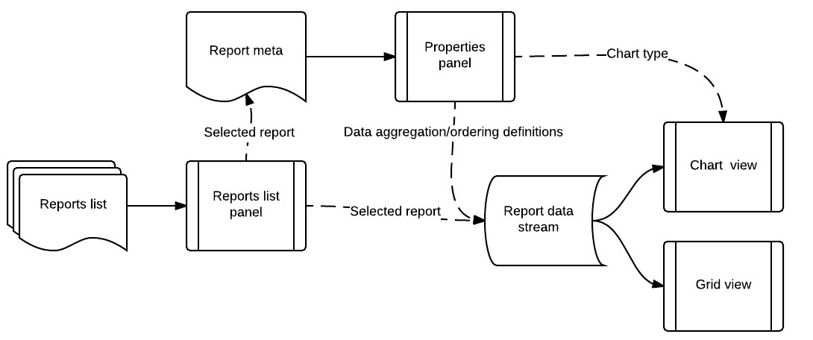

#Reporting UI


##Data interaction diagram:



*Solid lines represent external data; Dashed lines represent user input*


##Server JSON API definitions


###Base URL:

It would be nice to have live and historic data come from different subdomains. 
This will allow to get the live data straight from the data warehouse saving on ETLs. 

`historic.reports.domain.tld` - Historic data

`live.reports.domain.tld` - Live data

###GET /report

List available reports

| Name | Type | Description |
|---|---|---|
| page | int | Page number to get |
| pageSize | int | Page size. Default: 50 |
| filter | string | List filter string |
| ordering | string | List ordering column and optional order direction (`title  DESC`)|

#####Response

```JavaScript
{
	totalCount: 200,
	page: 1,
	pageSize: 50,
	data: [IReportEntry]
}
```

###GET /report/{id}

Get specified report meta by report ID.

#####Response

[`IReportMeta`](#ireportmeta)

###POST /report/{id}

####POST body

[`IReportOptions`](#ireportoptions)

#####Response

[`IReportData`](#ireportdata)


##Models
###Reports list
####IReportEntry

```JavaScript
{
	id: "8c628630-9aec-11e5-b82d-43de8931f253", // Report id
	reportNum: 148, // Report number (do we need this?)
	name: "Changes by category", // Report title in the list
	category: {
		id: "35eae4f8-9aee-11e5-8cfe-975723d3ed12" // Category ID
		name: "Change", // category title 
		color: "#0f0" // category color 
	}
}
```

###Report meta
####RecordType
* `historical`
* `live`

####IReportMeta
```JavaScript
{
	displayLabel: "Changes by category", // Report title 
	// Report data options
	dataConfigs: [{
		name: "filter",  // Name of the config section
		title: "Filter by", // Title of the config section
		type: "textfield", // Type of input to use for this config
		multiple: "And by", // Allow multiple inputs of this config option with title
		options: [{ // Possible input options
            value: "name",
            title: "Category name",
            live: true
        },{
            value: "cnt",
            title: "Count",
            live: true
        }],
        default: null
    },{
        name:  "aggregation",  // Aggregation is the core for data series preparation
		title: "Group by",
		type: "select",
		multiple: false,
		options: [{ // Each aggregation choice has chart(s) configuration
            value: "name",
            title: "Category name",
            live: true,
            charts: [{
                type: "bar",
                series: {
                    xAxis: "category_name",
                    yAxis: "cnt"
                }
            },{
                type: 'pie',
                series: {
                    xAxis: "category_name",
                    yAxis: "cnt"
                }
            }]
        },{
            value: "day",
            title: "Change day",
            live: false,
            charts: [{
                type: "line",
                title: "Line chart",
                series: {
                    xAxis: "changeDate",
                    yAxis: "cnt"
                }
            }]
        },{
            value: "hour",
            title: "Change hour",
            live: false,
            charts: [...]
        }],
        default: 'name'        
	},{
		name: "function",
		title: "Function",
		type: "select",
		multiple: false,
		options: [{
			value: "count",
			title: "Count",
			live: true
		},{
			value: "sum",
			title: "Sum of change values",
			live: true
		}],
		default: "count"
	},{
		name: "ordering",
		title: "Sort by",
		type: "select",
		multiple: "and then by",
		options: [{
            value: "name",
            title: "Category name",
            live: true  
        },{
            value: "date",
            title: "Recent change date",
            live: true  
        },{
            value: "cnt",
            title: "Count",
            live: true  
        }],
        default: "name"        		
	}]
}
```

###Report data
####IReportOptions

```JavaScript
{
	recordType: "historical",
	filter: [{
		type: "count",
		value: ">38"
	}],
	aggregation: "day",
	function: "count",
	ordering: ["date", "name"]
}
```

####IReportData

```JavaScript
{
	totalRowCount: 2000,
	returnedCount: 200,
	series: [{
		group_title: "Laptop Support",
		cnt: 39
	},{
		group_title: "Mobile Support",
		cnt: 98
	},
	...
	{
		group_title: "Other",
		cnt: 21
	}]
}
```


##AngularJs UI
###Services
####Reports
List of reports providing infinite scrolling. Keep current page number, go back and forward, keeping configured number of pages in memory and loading next or previous page on demand, removing the excessive data from memory cache.

#####Provider configs:
| Name | Type | Description |
|---|---|---|
| pageSize | int | Page size. Default: 50 |
| keepPages | int | How many pages to keep in memory. Default: 3 |

#####Reports.getData
```Reports.getData(page, ordering, searchTerm)```


Loads the specified page of data, optionally filtered by searchTerm, and stores searchTerm for future next/back operations.
 
| Name | Type | Description |
|---|---|---|
| page | int | Page number to get |
| ordering | string | List ordering column and optional order direction (`title  DESC`)|
| searchTerm | string | Search term to filter the list by on the server |
| `return` | Promise | Resolved to [`IReportEntry`](#ireportentry) |

#####Reports.getNext

`Reports.getNext()`
 
Load next (currentPage+1) page of data, removes excessive data from memory cache:

```JavaScript
if (data.length > pageSize * keepPages) {
  data.splice(0, data.length -  pageSize * keepPages);
}
```
#####Reports.getPrevious

`Reports.getPrevious()`

Load previous (currentPage-1) page of data, removes excessive data from memory cache:

```JavaScript
if (data.length > pageSize * keepPages) {
  data.splice(pageSize * keepPages);
}
```
####Report
Load report data and metadata.

#####Report.loadMeta
`Report.loadMeta(reportId)`

Load full meta data for provided report ID.

#####Report.loadData
`Report.loadData(reportId, config)` 

Load the report raw data with provided report configuration.

| Name | Type | Description |
|---|---|---|
| reportId | string | Report ID |
| config | [IReportOptions](#ireportoptions) | Report-specific configuration options such as aggregations, sorting, etc. |


##Views

###ReportsList

Renders left panel with recent and all reports lists. 

* Use Reports service to obtain data and provide infinite scrolling capability
* Use ng-repeat with item html template.
* Use localstorage service to store a capped LIFO(IReportEntry) of last viewed reports.
* Update the LIFO upon clicking on a report entry
* Broadcast clicked report ID to `$rootScope` as `openreport` event

###ReportProperties

Listen to `$rootScope` `openreport` event and get IReportMeta using `Report.loadMeta`
Render as a tabbed panel containing:

####ChartDataOptions directive

Gets the IReportMeta and renders the report preparation options tab.
Parse IReportMeta to html template using standart and custom directives for sections and input types then 
render resulting html with [`bind-html-compile`](https://github.com/incuna/angular-bind-html-compile)
Bind to the resulting field values to reload report data `Report.loadData()`
 
#####Directives
######TextInputGroup

Filter by ... and by ... 

######SelectGroup

Order by ... and by ...

####ChartOptions directive

Keeps various chart types configuration metadata and renders chart parameters form for selected chart type.
Logic is similar to live examples of [`angular-nvd3`](http://krispo.github.io/angular-nvd3/#/cumulativeLineChart) 
(see the configuration json on the right)

###Data presentation
####Chart
Use [`angular-nvd3` package](http://krispo.github.io/angular-nvd3) to render charts
####Grid
Use ui-grid to render grid with raw data
	
Switch the views via ng-if directive and boolean parameter `viewRaw`
	 
